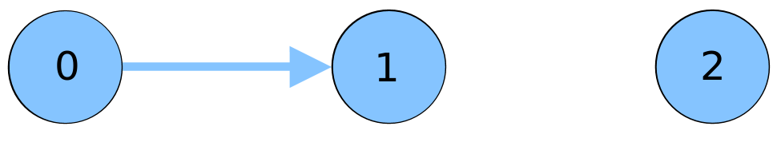

# Bitcoin sandbox guide

bitcoin_sandbox is a dockerized environment to create bitcoin networks for educational and research purposes. 
Docker containers are used to run bitcoin nodes (with bitcoind), which are in turn connected within each other 
to create the P2P network.

The tool allows three different alternatives to specify the connections between each node (that is, the Bitcoin network): 
* Deterministically, by manually specifying the connections in the source code.
* Deterministically, by loading a graph file that describes the connections.
* Randomly, by generating an erdos renyi graph with the given parameters (number of nodes and probability of creating
a connection between any two nodes). 

## Installation

1. Download / clone the repository.
2. Copy / rename `sample_conf.py` to `conf.py`. You can leave the default configuration values or tune them 
 to adjust your preferences. 
3. Install all the dependencies (`pip install -r requirements.txt`).

## Running the testbed

Once installed, you can run the testbed with:

`python run_scenarios.py`

Three basic scenarios, that demonstrate the three network creation alternatives are provided:
```
# Basic scenario: 2 nodes with 1 connection
# create_basic_scenario(client)
```

```
# Scenario from graph: gets topology from graph
create_scenario_from_graph_file(client, TEST_GRAPH_FILE_1)
```

```
# Scenario from a random graph:
# create_scenario_from_er_graph(client, 5, 0.3)
```

By default, `bitcoin_sandbox` will run a scenario where the network is loaded from a graph file. The scenario contains only three
Bitcoin nodes, connected as shown in the picture:



That is, there will be a connection from node 0 to 1 (created by node 0), and node 2 will have no connections.

A fourth more complex scenario is also provided (`run_scenario_vic1`), where once the network has been created, 
nodes start to mine and to propagate blocks through the network. Disconnections also happen, and thus the network
changes during the execution of the scenario. 

## Connecting to the containers

Running containers can be seen also from docker:

`docker ps`

(container names will be, by default, `btc_ni`, with i an integer denoting their id).

### Log into a container

You can execute bash inside one of the containers with:

`docker exec -it btc_ni /bin/bash`

(or `/bin/ash` for `alpine` based docker images).

### Run an RPC command

You cal also directly connect to a running bitcoind with RPC:

`bitcoin-cli -rpcconnect=172.17.0.1+i command`


